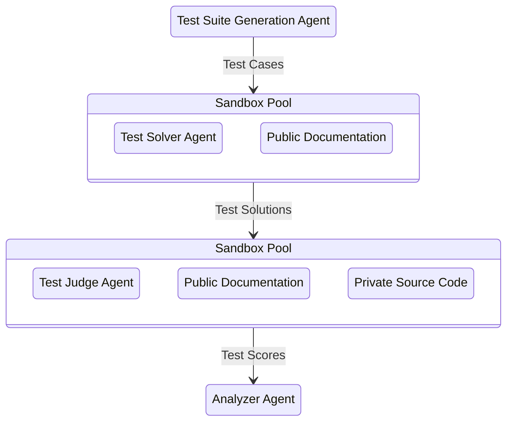

# Agentic Usability

A CLI tool that measures how well AI coding agents (Claude Code, Codex, Gemini CLI, etc.) can use your SDK. It generates programming problems from your SDK source, runs agents in sandboxed environments to solve them, then scores the results using an LLM judge that compares generated solutions against reference implementations.



## Prerequisites

- **Node.js >= 20**
- **Linux with KVM** or **macOS with Apple Silicon** (required by [microsandbox](https://github.com/PSPDFKit-labs/microsandbox) microVMs)
- **An AI agent CLI** installed locally for test generation and judging (e.g. Claude Code, Codex, Gemini CLI)
- **API keys** for the agent(s) you plan to use

## Installation

```bash
npm install -g @pspdfkit-labs/agentic-usability
```

Then run commands directly:

```bash
agentic-usability init -p pipelines/my-sdk-eval
```

### Install from source

```bash
git clone https://github.com/PSPDFKit-labs/agentic-usability.git
cd agentic-usability
npm install
npm run build
```

Then run commands via `npx`:

```bash
npx agentic-usability init -p pipelines/my-sdk-eval
```

## Claude Code Plugin

This package includes a [Claude Code plugin](https://code.claude.com/docs/en/discover-plugins) with skills for every CLI command. Once installed, you can run pipeline stages directly from Claude Code (e.g. `/agentic-usability:eval`).

### Install the plugin

From within Claude Code:

```
/plugin marketplace add PSPDFKit-labs/agentic-usability
/plugin install agentic-usability@agentic-usability-marketplace
/reload-plugins
```

### Available skills

| Skill | Description |
|-------|-------------|
| `/agentic-usability:init` | Create a new pipeline project |
| `/agentic-usability:generate` | Generate test suite from SDK source |
| `/agentic-usability:execute` | Run agents in sandboxes |
| `/agentic-usability:judge` | LLM judge scoring |
| `/agentic-usability:report` | Display scorecard |
| `/agentic-usability:eval` | Full pipeline (execute → judge → report) |
| `/agentic-usability:inspect` | Open web UI |
| `/agentic-usability:insights` | AI analysis of results |
| `/agentic-usability:export` | Export pipeline as zip |

## Quick Start

### 1. Initialize a project

```bash
agentic-usability init -p pipelines/my-sdk-eval
```

The interactive wizard walks you through configuring:
- **Private info** — where your SDK source code lives (local path, git repo, or URL). This is provided to the generator and judge but *not* the executor.
- **Public info** — package name, docs URLs, install command. This is what the executor agent sees.
- **Agents** — which AI CLI to use for each pipeline stage (claude, codex, gemini, or custom)
- **Targets** — Docker image + timeout for sandbox execution
- **Sandbox** — resource limits, secrets, environment variables

The wizard explains each field and provides sensible defaults. You can also `cd` into a directory and run `agentic-usability init` without `-p`.

### 2. Run the pipeline

```bash
agentic-usability eval -p pipelines/my-sdk-eval
```

This runs the evaluation pipeline: **execute → judge → report**.

Or run stages individually:

```bash
agentic-usability generate -p pipelines/my-sdk-eval
agentic-usability execute  -p pipelines/my-sdk-eval
agentic-usability judge    -p pipelines/my-sdk-eval
agentic-usability report   -p pipelines/my-sdk-eval
```

Use `--tests` to run specific test cases (comma-separated):

```bash
agentic-usability execute -p pipelines/my-sdk-eval --tests TC-001,TC-003
agentic-usability judge   -p pipelines/my-sdk-eval --tests TC-001,TC-003
```

## Project Directory Layout

Each pipeline project is a self-contained directory. Without `-p`, the CLI treats CWD as the project directory.

```
pipelines/my-sdk-eval/           # project root (= CWD or -p target)
  config.json                    # pipeline configuration
  suite.json                     # generated test cases
  results/                       # all evaluation runs
    run-2026-04-17T10-30-00-604Z/  # one directory per run
      run.json                   # run metadata (id, label, targets, testCount)
      pipeline-state.json        # resume checkpoint for this run
      report.json                # scorecard export for this run
      node-20/                   # per-target results
        TC-001/
          generated-solution.json
          workspace-snapshot.tar.gz  # sandbox state for judge reconstruction
          setup.log                  # workspace scaffolding log
          install-error.log          # agent CLI install failure (only on error)
          agent-cmd.log
          agent-output.log
          agent-notes.md             # agent's self-reported working notes
          agent-session.jsonl        # agent conversation log (if available)
          agent-egress.log.json      # executor egress logs
          agent-error.log            # execution error (only on error)
          judge.json
          judge-cmd.log
          judge-output.log
          judge-session.jsonl        # judge conversation log (if available)
          judge-egress.log.json      # judge egress logs
          judge-error.log            # judge error (only on error)
  cache/                         # git repo clones
    repos/
```

Each `eval` invocation creates a new run directory. Previous runs are preserved and browsable in the web UI.

## Commands

| Command | Description | Flags |
|---------|-------------|-------|
| `init` | Create a new pipeline project (interactive wizard) | `-p <dir>` |
| `generate` | Generate test suite from SDK source | `--fresh`, `--non-interactive` |
| `execute` | Run agents in sandboxes to solve test cases | `--tests <ids>`, `--run <runId>` |
| `judge` | LLM comparison of reference vs generated solutions | `--tests <ids>`, `--run <runId>` |
| `report` | Display terminal scorecard | `--json`, `--run <runId>` |
| `eval` | Run evaluation pipeline: execute → judge → report | `--resume`, `--fresh`, `--label <name>`, `--run <runId>` |
| `inspect` | Open web UI to inspect, edit, and run the pipeline | `--port <number>` |
| `insights` | Interactive AI analysis of pipeline results | `--fresh` |
| `export` | Export a pipeline as a zip (excludes cache and snapshots) | `-o <path>`, `-r <runId>` |

## Configuration Reference

The config file is `config.json` inside the project directory. See the [`examples/`](examples/) directory for real-world configs covering web SDKs, mobile SDKs, REST APIs, and more.

### Private Info (`privateInfo`)

**Required.** An array of sources defining where your SDK code lives. These are provided to the generator (for creating test cases) and the judge (for scoring), but **not** to the executor agent. You can mix source types.

Each entry has a `type` field: `local`, `git`, `url`, or `package`.

#### Local source

```json
{
  "privateInfo": [
    {
      "type": "local",
      "path": "/path/to/sdk",
      "subpath": "packages/core",
      "additionalContext": "Focus on the Builder API, ignore legacy v1 namespace"
    }
  ]
}
```

| Field | Description |
|-------|-------------|
| `path` | Absolute or relative path to SDK source directory |
| `subpath` | Scope to a subdirectory (e.g. monorepo package) |
| `additionalContext` | Extra guidance appended to the generator/judge prompt |

#### Git source

```json
{
  "privateInfo": [
    {
      "type": "git",
      "url": "https://github.com/org/sdk.git",
      "branch": "main",
      "subpath": "packages/core",
      "sparse": ["src/", "docs/"]
    }
  ]
}
```

| Field | Description |
|-------|-------------|
| `url` | Git repository URL |
| `branch` | Branch to clone (default: `main`) |
| `subpath` | Scope to a subdirectory after cloning |
| `sparse` | Only download these paths (sparse checkout — saves time on large repos) |
| `additionalContext` | Extra guidance appended to the generator/judge prompt |

#### URL source

```json
{
  "privateInfo": [
    { "type": "url", "url": "https://internal.example.com/sdk/api-spec.json" }
  ]
}
```

#### Package source

```json
{
  "privateInfo": [
    {
      "type": "package",
      "name": "@example/sdk",
      "installCommand": "npm install @example/sdk",
      "language": "typescript"
    }
  ]
}
```

| Field | Description |
|-------|-------------|
| `name` | Package name |
| `installCommand` | Install command for the package |
| `language` | Preferred solution language (e.g. `python`, `typescript`). Used by both generator and executor. |
| `additionalContext` | Extra guidance appended to the prompt |

### Public Info (`publicInfo`)

**Optional.** An array of sources (same types as `privateInfo`) provided to the **executor** and **judge** agents. This is what the executor "sees" when solving problems — typically package metadata and public documentation URLs. The judge also receives these alongside `privateInfo`.

```json
{
  "publicInfo": [
    {
      "type": "package",
      "name": "@example/sdk",
      "installCommand": "npm install @example/sdk",
      "language": "typescript"
    },
    { "type": "url", "url": "https://docs.example.com/api" },
    { "type": "url", "url": "https://docs.example.com/quickstart" }
  ]
}
```

### Agents

Each pipeline stage can use a different agent CLI. Built-in adapters: `claude`, `codex`, `gemini`. Any other command uses the custom adapter.

```json
{
  "agents": {
    "generator": { "command": "claude" },
    "executor":  { "command": "claude" },
    "judge":     { "command": "claude" },
    "insights":  { "command": "claude" }
  }
}
```

To select a specific model, use `args` with the CLI's model flag:

```json
{
  "agents": {
    "generator": { "command": "claude", "args": ["--model", "claude-sonnet-4-20250514"] },
    "executor":  { "command": "codex",  "args": ["-m", "o3"] },
    "judge":     { "command": "gemini", "args": ["-m", "gemini-2.5-pro"] }
  }
}
```

| CLI | Model flag |
|-----|-----------|
| `claude` | `--model <id>` |
| `codex` | `-m <id>` |
| `gemini` | `-m <id>` |

#### Agent secret (required for executor/judge)

Sandboxed agents (executor and judge) require a `secret` for secure API key injection. microsandbox handles secrets via TLS interception — the raw value never enters the VM. The secret also drives the judge's network lockdown allowlist.

For known agents (`claude`, `codex`, `gemini`), only `value` is required — `envVar`, `baseUrl`, and `baseUrlEnvVar` are auto-detected:

```json
{
  "agents": {
    "executor": {
      "command": "claude",
      "secret": { "value": "$ANTHROPIC_API_KEY" }
    },
    "judge": {
      "command": "claude",
      "secret": { "value": "$ANTHROPIC_API_KEY" }
    }
  }
}
```

For custom agents, all fields must be specified:

```json
{
  "agents": {
    "executor": {
      "command": "my-agent",
      "secret": {
        "envVar": "MY_API_KEY",
        "value": "$MY_API_KEY",
        "baseUrl": "https://api.example.com"
      }
    }
  }
}
```

Generator and insights agents run locally and do not require a secret.

| Field | Description |
|-------|-------------|
| `value` | Raw value or `$ENV_VAR` reference resolved from host environment. **Required.** |
| `envVar` | Environment variable name for the API key. Auto-detected for known agents. |
| `baseUrl` | API base URL. Hostname is used for network allowlisting. Auto-detected for known agents. |
| `baseUrlEnvVar` | Override the base URL env var name. Auto-detected for known agents. |

#### Custom agents

Custom agents support additional args fields with `{prompt}` and `{workDir}` placeholders:

| Field | Description |
|-------|-------------|
| `args` | Base args for all modes |
| `interactiveArgs` | Override `args` in interactive mode |
| `pipedArgs` | Override `args` in piped (non-interactive) mode |
| `sandboxArgs` | Override `args` in sandbox mode |
| `installCommand` | Install command run inside sandbox before execution |
| `envelope` | JSON field to extract from stdout (e.g. `"output"`). `"none"` skips JSON parsing. |
| `systemPrompt` | System prompt template. `{{packageName}}` and `{{docsUrl}}` are interpolated. |
| `logPattern` | Glob pattern for finding agent session logs inside sandbox |

### Targets

Docker environments where agents solve problems. Each target runs independently — results are stored per-target. Bear in mind that the image should have Node and npm installed for the installation of Agent CLI

```json
{
  "targets": [
    { "name": "node-20", "image": "node:20-slim", "timeout": 600 },
    { "name": "python-3.12", "image": "nikolaik/python-nodejs:python3.12-nodejs20-slim", "timeout": 1200 }
  ]
}
```

| Field | Description |
|-------|-------------|
| `name` | Target identifier (used in results directory names) |
| `image` | Docker image |
| `timeout` | Seconds per sandbox (overrides `sandbox.defaultTimeout`) |
| `additionalContext` | Extra context included in the generator prompt for target-specific setup instructions |

> **Note:** Target images must include `tar` and `base64` utilities. After the executor finishes, the CLI captures a workspace snapshot (`tar czf`) so the judge can restore the exact environment. Most standard images (node, python, ubuntu, alpine) include these by default.

### Workspace

Template files and setup scripts for the test workspace:

```json
{
  "workspace": {
    "template": "./templates/workspace",
    "setupScript": "./scripts/setup.sh"
  }
}
```

| Field | Description |
|-------|-------------|
| `template` | Local directory uploaded to `/workspace/` in the sandbox |
| `setupScript` | Script file uploaded and executed during scaffolding |

### Sandbox

Resource limits, secrets, and environment variables for sandbox VMs:

```json
{
  "sandbox": {
    "concurrency": 3,
    "defaultTimeout": 600,
    "memoryMib": 2048,
    "cpus": 2,
    "secrets": {
      "DATABASE_URL": {
        "value": "$DATABASE_URL",
        "allowHosts": ["db.example.com"]
      }
    },
    "env": {
      "NODE_ENV": "test"
    }
  }
}
```

| Field | Description |
|-------|-------------|
| `concurrency` | Max parallel sandbox instances (default: 3) |
| `defaultTimeout` | Seconds per sandbox if not set per-target (default: 600) |
| `memoryMib` | Memory limit per sandbox in MiB |
| `cpus` | CPU count per sandbox |
| `secrets` | Secrets managed by microsandbox TLS injection (see below) |
| `env` | Plain env vars passed directly into the sandbox |

#### Security: microsandbox TLS Secret Injection

Secrets defined in `sandbox.secrets` (and in `agents.*.secret`) are handled by microsandbox's TLS interception layer. **Real secret values never enter the VM.** microsandbox intercepts outbound TLS connections and injects credentials only for requests to allowed hosts.

Each secret specifies which hosts it can be sent to:

```json
{
  "sandbox": {
    "secrets": {
      "API_KEY": {
        "value": "$API_KEY",
        "allowHosts": ["api.example.com"],
        "allowHostPatterns": ["*.googleapis.com"]
      }
    }
  }
}
```

| Field | Description |
|-------|-------------|
| `value` | Raw value or `$ENV_VAR` reference resolved from host environment |
| `allowHosts` | Exact hostnames where this secret can be sent |
| `allowHostPatterns` | Wildcard patterns (e.g. `*.googleapis.com`) |

Agent secrets (`agents.*.secret`) are automatically merged into the sandbox secrets at creation time, with `allowHosts` derived from the `baseUrl` hostname.

### Environment Variables

You can create a `.env` file in your project root (loaded automatically, git-ignored by default):

```bash
ANTHROPIC_API_KEY=sk-ant-...
OPENAI_API_KEY=sk-...
```

#### 1Password support

Instead of storing plain-text secrets in `.env`, you can use [1Password CLI](https://developer.1password.com/docs/cli/) references. Values starting with `op://` are resolved at startup via `op read`:

```bash
# .env — secrets stay in 1Password, never on disk
ANTHROPIC_API_KEY=op://Engineering/Anthropic/api-key
OPENAI_API_KEY=op://Shared/OpenAI/credential
```

Requirements:
- Install the `op` CLI: https://developer.1password.com/docs/cli/get-started/
- Sign in: `op signin`

The resolution happens once at CLI startup. If a reference can't be resolved, the CLI exits with a clear error. Shell environment variables still take precedence over `.env` values (including `op://` references).

## Web UI (Inspect)

The `inspect` command launches a local web interface for browsing results, editing test suites, and running pipeline stages:

```bash
agentic-usability inspect -p pipelines/my-sdk-eval
# Opens http://localhost:7373 in your browser

agentic-usability inspect -p pipelines/my-sdk-eval --port 8888
# Use a custom port
```

The UI includes:
- **Dashboard** — scorecard overview with aggregate metrics per target, scoped to the selected run
- **Runs** — browse, rename, and delete evaluation runs; view per-test-case results with filterable verdicts
- **Suite Editor** — add, edit, and delete test cases with a form-based editor
- **Config Editor** — edit `config.json` with a Monaco JSON editor

A global run selector in the header lets you switch between runs. The selection persists across page navigation.

The server reads and writes directly to the pipeline project directory. Press Ctrl+C in the terminal to stop.

## Insights

The `insights` command launches an interactive AI session pre-loaded with all pipeline results. It helps you interpret benchmark scores, identify SDK usability gaps, and prioritize improvements:

```bash
agentic-usability insights -p pipelines/my-sdk-eval
```

The agent is given:
- **Aggregate scores** per target — judge scores, pass rate, and difficulty breakdowns
- **Per-test-case results** — problem statements, scores, verdicts, and judge notes
- **File paths** to generated solutions and judge assessments for deep dives
- **Scoring methodology** — the exact difficulty rubric and judge scoring bands used during evaluation
- **SDK source locations** — so the agent can read your source code and correlate failures with API design

Ask about failure patterns, documentation gaps, API design issues, or request prioritized improvement recommendations. The agent can read any file in the project directory for deeper analysis.

## Pipeline and Resume

The `eval` command orchestrates 3 stages: **execute → judge → report**. Each eval creates a new **run** — an isolated directory under `results/` with its own pipeline state and artifacts. Previous runs are preserved and browsable in the web UI.

```bash
# Basic run
agentic-usability eval -p pipelines/my-sdk-eval

# Label a run for easy identification
agentic-usability eval -p pipelines/my-sdk-eval --label "baseline v2"

# Resume after interruption (finds latest incomplete run)
agentic-usability eval -p pipelines/my-sdk-eval --resume

# Resume a specific run
agentic-usability eval -p pipelines/my-sdk-eval --resume --run run-2026-04-17T10-30-00-604Z
```

Run standalone stages against a specific run (defaults to the latest run):

```bash
agentic-usability judge  -p pipelines/my-sdk-eval --run run-2026-04-17T10-30-00-604Z
agentic-usability report -p pipelines/my-sdk-eval --run run-2026-04-17T10-30-00-604Z
```

## Test Suite Format

The test suite (`suite.json`) is a JSON array of test cases. Difficulty levels have specific meanings:

- **easy** — Task directly demonstrated in public docs/guides/examples. Agent can adapt an existing example.
- **medium** — Uses supported functions with different configs, params, or setups not shown in any guide. Single-function extrapolation.
- **hard** — Combines multiple SDK functions in ways not directly documented. Multi-function extrapolation and orchestration.

```json
[
  {
    "id": "TC-001",
    "problemStatement": "Create a function that...",
    "referenceSolution": [
      { "path": "solution/index.ts", "content": "import { Client } from..." }
    ],
    "difficulty": "medium",
    "tags": ["querying", "filtering"],
    "setupInstructions": "npm install @example/sdk"
  }
]
```

## Scoring

### LLM Judge (Sandboxed)

The judge runs inside a sandbox with the same target image as the executor. It restores the executor's workspace (via snapshot or re-scaffolding), has access to the SDK source code at `/workspace/sources/`, and can run the generated solution to verify it works. It scores across four orthogonal dimensions, focusing on SDK/API usage (not general code style):

| Metric | Description |
|--------|-------------|
| API Discovery | Did the agent find and use the correct SDK endpoints/methods? |
| Call Correctness | Are API calls constructed correctly (parameters, headers, body)? |
| Completeness | Does the solution handle all requirements, edge cases, and errors? |
| Functional Correctness | Does the code actually run and produce correct output? |
| Overall Verdict | Boolean pass/fail — would it pass acceptance tests? |

## Project Structure

```
src/
  core/           types, config, paths, pipeline state, source resolver, suite I/O, results
  agents/         adapter pattern: claude, codex, gemini, custom + spawn utility
  sandbox/        microsandbox client, workspace scaffolding, worker pool, egress logging
  scoring/        LLM judge
  commands/       one file per CLI command
  server/         Express API server for the inspect UI
ui/               React SPA (Vite + Monaco editor)
```

## License

Apache-2.0
